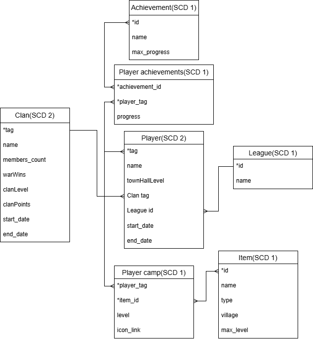

# Лабораторная работа №2
Работу выполнили студенты Чебыкин Артём и Чернов Егор

## 1. Структура хранилища данных

После анализа структуры и содержания данных, получаемых из API Clash of Clans, была выбрана схема хранилища типа «снежинка». Такое решение обусловлено тем, что данные имеют несколько уровней вложенных измерений и сложные связи между сущностями, что делает использование схемы «звезда» неэффективным. В качестве целевой системы управления базами данных используется PostgreSQL.

### 1.1. Реляционная схема базы данных

Реляционная схема базы данных отражает логическую структуру данных API Clash of Clans и представлена на рисунке ниже. Центральной сущностью является игрок, вокруг которого формируются связанные измерения и факты. Игрок связан с кланом (текущим или историческим), лигой, набором достижений, а также с боевым лагерем, включающим отряды, героев и зелья. Такая декомпозиция позволяет гибко хранить данные и минимизировать избыточность.

### 1.2. Использование концепции SCD

Для хранения изменяющихся во времени данных применена концепция Slowly Changing Dimensions. Тип SCD был выбран индивидуально для каждой таблицы с учётом характера изменений данных.

Историчность хранения реализована для таблиц Player и Clan с использованием SCD типа 2, так как изменения этих сущностей (например, смена клана или обновление характеристик игрока) имеют аналитическую ценность. Для остальных таблиц используется SCD типа 1, при котором новые данные полностью заменяют старые, поскольку хранение истории изменений для них не требуется.

## 2. Организация ETL-процессов

### 2.1. Общая архитектура пайплайна

ETL-процесс реализован в виде последовательности DAG-ов и состоит из нескольких этапов. На первом этапе осуществляется загрузка сырых данных из API и их сохранение в отдельный бакет MinIO. Далее данные извлекаются из хранилища, нормализуются, проходят проверку на уникальность и сохраняются в формате Parquet, раздельно по таблицам и кланам.

На следующем этапе применяется логика SCD: нормализованные данные загружаются из MinIO, обновляются таблицы с поддержкой историчности и результат сохраняется в PostgreSQL. Завершающим этапом является проверка качества обработанных данных.

### 2.2. Взаимодействие между этапами ETL

Связь между этапами реализована с помощью сенсеров в Airflow. Первый и третий DAG используют ExternalTaskSensor и запускаются только после успешного завершения предыдущих этапов. Для второго DAG применяется S3KeySensor, который отслеживает появление новых или обновлённых файлов в MinIO и инициирует процесс нормализации при наличии изменений.

### 2.3. Контроль качества данных

Для обеспечения корректности и надёжности данных реализован набор проверок качества на этапе после нормализации. Проверяется соответствие объёмов данных до и после обработки, выявляются аномальные значения, а также валидируется корректность реализации SCD типа 2, включая правильность ведения исторических записей.