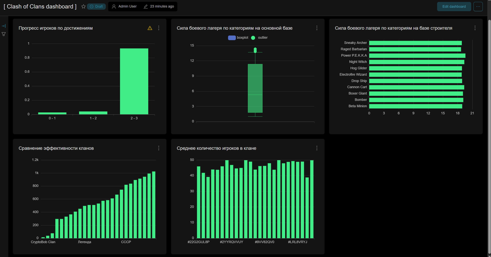

# Лабораторная работа №3
Работу выполнили студенты Чебыкин Артём и Чернов Егор

## 1. Развертывание Superset

В рамках проекта была интегрирована платформа визуализации данных Apache Superset. Для обеспечения изоляции и удобства развертывания Superset был размещен в отдельном контейнере Docker. Все параметры конфигурации и настройки окружения хранятся в файлах docker-compose.yaml и .env.

## 2. Построение витрин данных

Для анализа игровой активности и характеристик игроков и кланов были созданы три основные витрины данных:

* mart_clan_activity — содержит информацию о кланах, включая тег, название, дату начала, количество побед в войнах и количество очков клана. Данные фильтруются по текущим активным кланам (параметр end_date = '9999-12-31') и сортируются по дате начала и тегу клана.

* mart_clan_stats — витрина, агрегирующая данные о боевом потенциале клана. Для каждого типа войск учитываются средний, максимальный и минимальный уровень, а также количество уникальных игроков, участвующих в боевых действиях. Данные строятся на основе объединения таблиц игроков, кланов, лагерей и войск, что позволяет получить детализированную информацию о составе и силе клана.

* mart_player_activity — хранит сведения о достижениях игроков, включая идентификатор игрока, имя, прогресс по каждому достижению, а также дату начала активности. Витрина обеспечивает возможность анализа динамики прогресса игроков и выявления наиболее активных участников.

## 3. Визуализация обработанных данных

На основе созданных витрин данных был создан ключевой дашборд для анализа игровой активности и эффективности кланов:

Прогресс игроков по достижениям визуализирован с помощью гистограммы, где ось X отражает средний прогресс, а ось Y — названия достижений. Это позволяет оценить, какие достижения наиболее популярны и где игроки проявляют наибольшую активность.

Сила боевого лагеря по категориям на основной базе и на базе строителя представлена диаграммами с усами и столбчатыми диаграммами соответственно. Визуализация учитывает средний уровень войск для каждого типа и позволяет фильтровать данные по типу войск и локации базы. Такой подход дает полное представление о распределении сил внутри клана и сравнении между кланами.

Эффективность кланов анализируется с помощью столбчатой диаграммы, где ось X отражает название клана, а ось Y суммарное количество побед в войнах. Дополнительно рассчитано среднее количество игроков в клане, что позволяет оценить плотность состава и потенциал клана в целом.

Использование подобных типов графиков обусловлено особенностями данных: гистограммы подходят для анализа распределений, диаграммы с усами — для изучения вариативности и разброса, столбчатые диаграммы — для прямого сравнения агрегированных показателей. Такое сочетание обеспечивает полное и наглядное представление ключевых метрик проекта.

